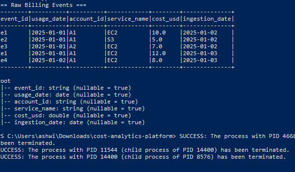
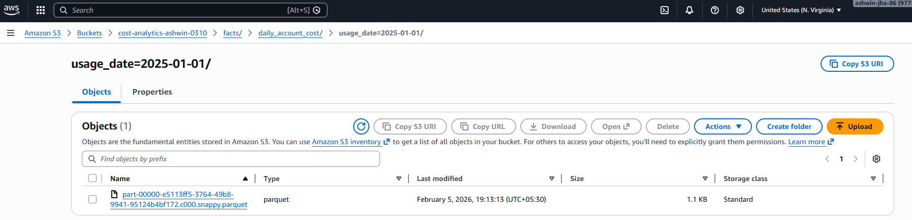
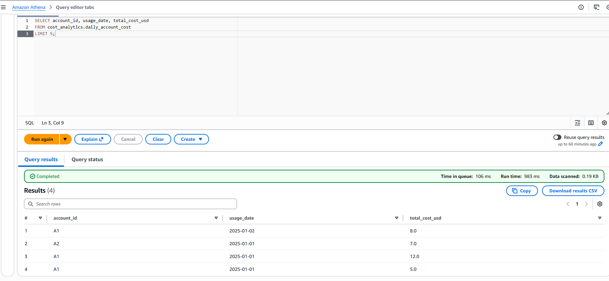
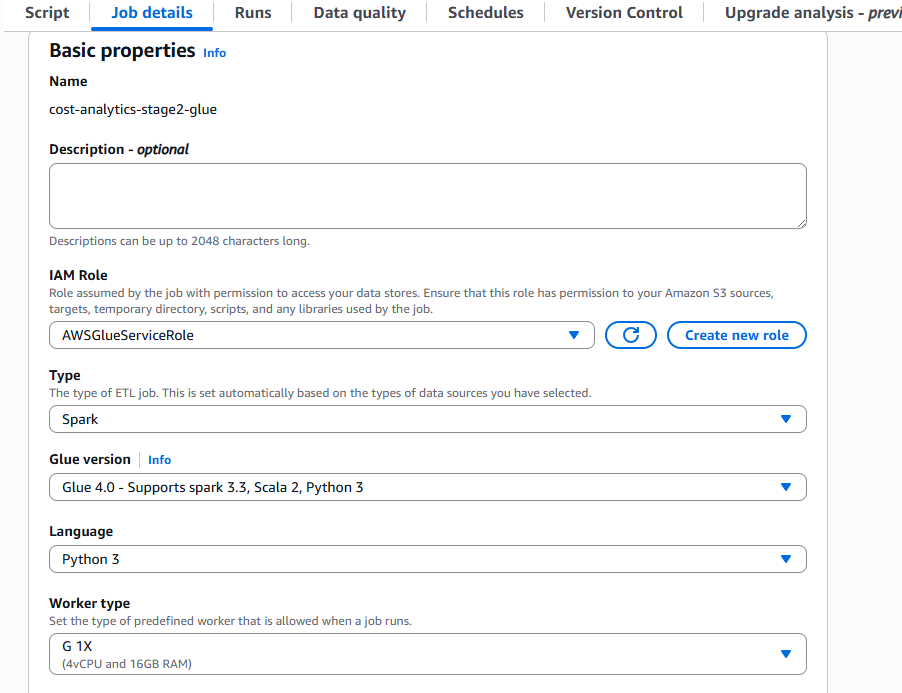
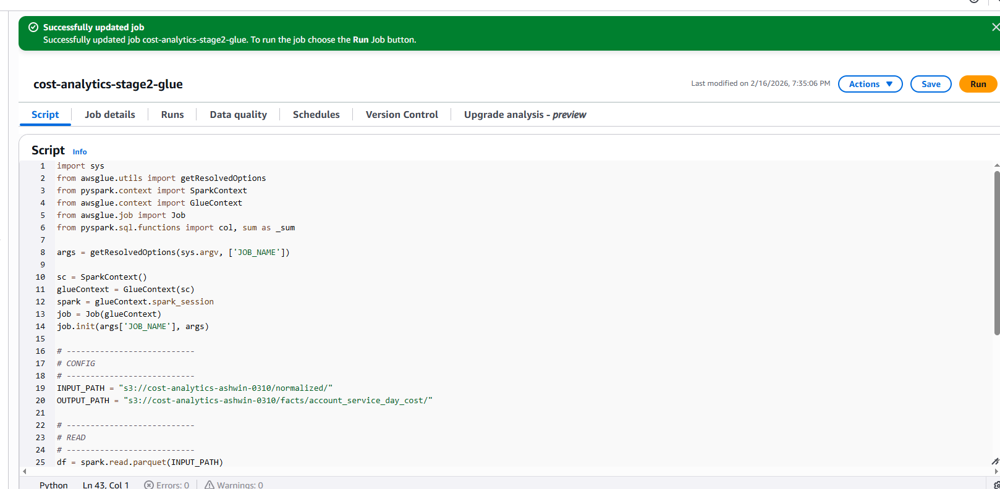
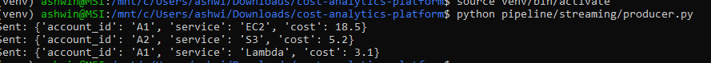
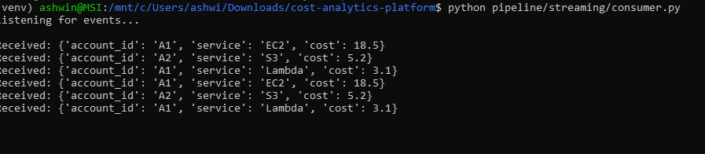
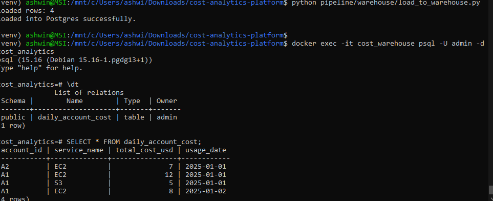
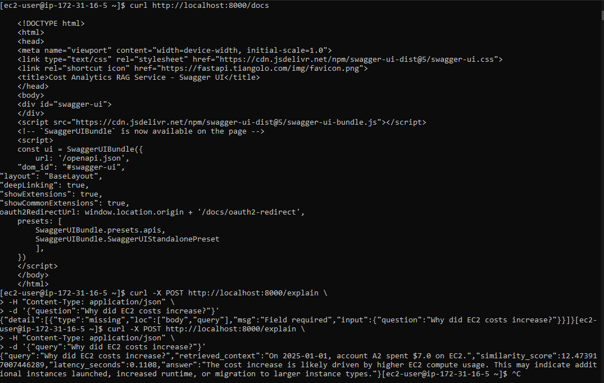

# Multi-Tenant Cost Analytics Platform

### Spark Lakehouse + Warehouse + RAG-Powered Cost Intelligence

An end-to-end cloud cost analytics platform built using Spark on EC2, Amazon S3, and Athena, extended with a Retrieval-Augmented Generation (RAG) layer for anomaly investigation.

The system transforms raw billing events into canonical, partitioned financial datasets and exposes an API layer that generates context-aware explanations using vector retrieval and a provider-agnostic LLM abstraction.

---

---

## Table of Contents

1. [Problem Statement](#1-problem-statement)
### PART I — Core Data Platform (Data Engineering)
2. [Architecture Overview — Core Data Platform](#2-architecture-overview--core-data-platform)
3. [Cloud Deployment (Implemented)](#3-cloud-deployment-implemented)
4. [Data Pipeline (Spark + S3 + Athena)](#4-data-pipeline-spark--s3--athena)
5. [Warehouse & Streaming Extensions](#5-warehouse--streaming-extensions)
6. [Observability & Operational Controls](#6-observability--operational-controls)
### PART II — GenAI Extension (RAG + LLM Layer)
7. [GenAI Architecture Overview](#7-genai-architecture-overview)
8. [GenAI RAG Pipeline](#8-genai-rag-pipeline)
9. [API Layer](#9-api-layer)
10. [Monitoring & Observability (GenAI Layer)](#10-monitoring--observability-genai-layer)
### PART III — Validation & Evidence
11. [Execution Evidence](#11-execution-evidence)
12. [Design Decisions & Tradeoffs](#12-design-decisions--tradeoffs)
13. [Key Engineering Learnings](#13-key-engineering-learnings-)
14. [Business Impact](#14-business-impact-)
15. [Project Highlights](#15-project-highlights-)

---


## 1. Problem Statement

Cloud cost and usage data introduces several non-trivial data engineering challenges:

- Billing events arrive **late or out of order**
- Previously reported costs are **retroactively corrected**
- Finance reporting requires **detinistic recomputation for audits**
- Aggregations must prevent **double counting**
- Downstream consumers require **stable, canonical financial datasets**

In parallel, finance and engineering teams increasingly expect:

- Natural-language explanations of cost anomalies
- Self-serve analytical access
- Context-aware insights instead of static reports

This platform addresses both layers:

1. A finance-grade data foundation built on explicit data modeling, partitioned lakehouse design, and deterministic backfills.
2. A GenAI extension layer that retrieves historical anomalies and generates structured explanations through a RAG pipeline.
---
# PART I — Core Data Platform (Data Engineering)

---

## 2. Architecture Overview — Core Data Platform

The system is implemented as two clearly separated layers:

1. **Deterministic Data Platform (Spark + S3 + Athena + Postgres)**
2. **Retrieval-Augmented Generation (RAG) Service**

This separation enforces clean ownership boundaries between data correctness and AI reasoning.

---

### 2.1 Structured Data Platform (Spark)

```text
Raw Billing Events (CSV)
        |
        v
Stage 1 — Normalize & Deduplicate (event-level)
        |
        v
Stage 2 — Aggregate Daily Cost Facts (account-service-day)
        |
        v
Stage 3 — Publish Canonical Daily Dataset (account-day)
        |
        v
Partitioned Parquet in S3 (partitioned by usage_date)
        |
        +--------------------+
        |                    |
        v                    v
Amazon Athena        Warehouse Load (Postgres)
(Query Layer)        (Downstream Analytics)
```

Key characteristics:
- Explicit data grains at each stage 
- Deterministic recomputation from normalized source data 
- Partition-scoped overwrite semantics in S3
- Glue catalog registration for metadata management
- Canonical dataset optimized for financial reporting queries

Each stage owns its transformation contract and can be recomputed independently.

Backfills are partition-bounded and do not require full-table reloads, ensuring audit-safe and predictable recomputation.

---

## 3. Cloud Deployment (Implemented)

The platform was deployed and executed on AWS to validate end-to-end cloud integration across compute, storage, metadata, and query layers.

---

### Compute Layer

- **Spark on EC2**
  - Custom Spark environment configured with Hadoop S3A integration
  - IAM instance profile attached for secure S3 access
  - Jobs executed via `spark-submit`
  - Deterministic partition-scoped writes to S3

---

### Storage Layer

- **Amazon S3**
  - Partitioned Parquet datasets written using `s3a://`
  - `usage_date` used as partition key for pruning and bounded recomputation
  - Partition-level overwrite semantics for safe backfills
  - Immutable normalized layer for recomputation safety

---

### Metadata & Query Layer

- **AWS Glue Catalog**
  - External table registered over partitioned S3 location
  - Dynamic partition discovery for incremental updates

- **Amazon Athena**
  - Canonical dataset queried directly over Parquet
  - Partition pruning verified through query inspection
  - Query results stored in S3

---

### Security Model

- IAM instance profile attached to EC2
- Role-based S3 access (no hardcoded credentials)
- IAM-scoped permissions limited to required services (S3 + embedding access)
- No local secret storage in application code

---

### Deployment Validation

This cloud execution validates:

- End-to-end execution from Spark compute → S3 storage → Athena query
- Lakehouse-style partitioned dataset design
- Secure, role-based access control
- Reproducible execution outside local development environments

---

## 4. Data Pipeline (Spark + S3 + Athena)

This section describes the deterministic data platform responsible for ingesting, modeling, aggregating, and publishing canonical cost datasets.

All datasets are stored as **partitioned Parquet files in Amazon S3** and exposed via **AWS Glue + Amazon Athena**.

---

### 4.1 Execution Flow

Spark jobs were executed on an EC2 instance using local Spark mode with S3-backed storage (`s3a://`).

Run sequentially:

```bash
spark-submit pipeline/batch/stage1_normalize.py
spark-submit pipeline/batch/stage2_aggregate.py
spark-submit pipeline/batch/stage3_publish.py
```
End-to-End Flow:
1. Spark jobs execute on EC2.
2. Partitioned Parquet datasets are written to S3.
3. Glue external table references the S3 location.
4. Athena queries the canonical dataset with partition pruning.

This execution validates:
- Deterministic partition-scoped writes 
- Reproducible recomputation 
- Lakehouse-style storage patterns 
- Queryable analytics datasets without data movement

---

### 4.2 Repository Structure 

```text
pipeline/
  batch/                       # Deterministic Spark pipeline
    stage1_normalize.py
    stage2_aggregate.py
    stage3_publish.py

  dq/                          # Data quality validation
    validate_daily_account_cost.py

  glue_jobs/                   # Glue-compatible Spark job scripts

  streaming/                   # Kafka producer/consumer demo

  warehouse/                   # Postgres warehouse load script

genai/                         # Retrieval-Augmented Generation layer

data/
  raw_billing_events.csv

docs/
  data_product.md

README.md
```
The `pipeline/batch` directory contains the deterministic data pipeline.

The `genai/` directory contains the Retrieval-Augmented Generation layer (described later in Section 7).

---

### 4.3 Data Model

The platform is built around explicit canonical data models with well-defined grains, partitioning semantics, and deterministic recomputation guarantees.

All datasets are stored as **partitioned Parquet files in S3** and exposed through **AWS Glue + Athena**.

---

### Stage 1 — Normalized Billing Events


**Location:** `s3://cost-analytics-ashwin-0310/normalized/`  
**Grain:** `event_id`

Purpose:

- Deduplicate raw billing events using latest-ingestion-wins semantics
- Preserve late-arriving and corrected events
- Establish an immutable system of record for recomputation

Characteristics:

- Idempotent reruns
- Immutable partition writes
- Sole source for downstream aggregations

---

### Stage 2 — Daily Cost Fact

**Table:** `account_service_day_cost`  
**Location:** `s3://cost-analytics-ashwin-0310/facts/daily_account_cost/`  
**Partitioned by:** `usage_date`  
**Grain:** `(account_id, service_name, usage_date)`  
**Metric:** `total_cost_usd`

This grain:

- Prevents event-level explosion
- Enables service-level cost attribution
- Supports anomaly detection and drill-down analysis
- Enables efficient Athena partition pruning

---

### Stage 3 — Canonical Published Dataset

**Table:** `daily_account_cost`  
**Grain:** `(account_id, usage_date)`  
**Derived From:** Stage 2 fact table

Columns:

- `account_id`
- `usage_date`
- `total_cost_usd`
- `data_complete`
- `published_at`

This dataset represents the authoritative daily cost view for downstream consumers.

All SLAs, validation checks, and partition-level publish semantics are enforced at this layer.

---

### 4.4 Dimensional Modeling Strategy

Dimensions are logically separated from fact tables and evolve independently.

- `dim_account` — billing ownership metadata
- `dim_service` — service identifiers (EC2, S3, etc.)
- `dim_region` — geographic cost attribution
- `dim_pricing_model` — on-demand, reserved, spot

This separation:

- Preserves fact grain stability
- Enables controlled schema evolution
- Prevents cascading downstream rewrites
- Keeps analytical joins predictable

---

### 4.5 Why This Model

- `account_id + usage_date` is the canonical financial reporting grain.
- `account_id + service_name + usage_date` enables controlled drill-down and anomaly detection.
- Explicit grains eliminate ambiguous rollups and hidden double counting.
- Partitioning by `usage_date` ensures bounded recomputation and cost-efficient querying.

This modeling approach balances financial correctness, analytical flexibility, and GenAI-ready anomaly retrieval.

---

### 4.6 Double Counting Prevention


Double counting is prevented by:

- Enforcing event-level deduplication prior to aggregation
- Maintaining explicit aggregation grains
- Using partition-scoped overwrite semantics in S3
- Recomputing exclusively from normalized source data

Derived datasets are never used as recomputation inputs.

---

## 5. Warehouse & Streaming Extensions

In addition to the deterministic batch pipeline, the platform includes optional extensions to demonstrate managed execution, streaming patterns, and downstream warehouse integration.

These extensions are modular and do not alter the core canonical data platform.

---

### 5.1 Glue Job (Managed Spark Execution)

A Glue-compatible version of the Stage 2 aggregation logic was created to demonstrate portability to managed Spark environments.

Key characteristics:

- Glue job script stored in `pipeline/glue_jobs/`
- External S3 script path configuration
- IAM-based execution role (`AWSGlueServiceRole`)
- Writes partitioned Parquet to S3
- Compatible with Glue Catalog + Athena

Purpose:

- Demonstrates Spark portability beyond EC2
- Validates managed job execution model
- Aligns with enterprise Spark deployment patterns

The underlying transformation logic remains identical to the EC2 Spark implementation, ensuring deterministic behavior across environments.

---

### 5.2 Kafka Streaming Skeleton

A lightweight Kafka producer/consumer demo was implemented using Docker-based Kafka and Zookeeper.

Components:

- `pipeline/streaming/kafka_producer.py`
- `pipeline/streaming/kafka_consumer.py`
- `docker-compose.yml` for local Kafka cluster

Purpose:

- Demonstrates understanding of event-driven ingestion patterns
- Simulates streaming cost event publishing
- Illustrates separation between streaming ingestion and batch canonical modeling

Important architectural note:

The core financial reporting pipeline remains batch-oriented (T+1 model), while streaming is treated as an ingestion layer rather than a financial publish layer.

This reflects real-world finance systems where correctness supersedes real-time freshness.

---

### 5.3 Warehouse Load (Postgres / Redshift-ready)

A warehouse load script was implemented to demonstrate downstream analytics integration.

Components:

- `pipeline/warehouse/load_to_warehouse.py`
- Docker-based Postgres instance (`cost_warehouse`)
- SQLAlchemy-based data load

Workflow:

1. Canonical partitioned Parquet exported from S3.
2. Loaded into Postgres table `daily_account_cost`.
3. Table becomes immediately queryable for BI-style analytics.

Purpose:

- Demonstrates data lake → warehouse pattern
- Validates schema portability
- Shows familiarity with SQL-based analytical consumption

The script is Redshift-compatible with minimal connection string changes.

---

## 6. Observability & Operational Controls

The platform enforces financial correctness through explicit validation, partition-scoped publishing, and deterministic recomputation guarantees.

---

### 6.1 Data Availability Model (T+1)

The canonical dataset (`daily_account_cost`) follows a **T+1 publishing model**:

- Daily aggregates are published the next day.
- A `usage_date` partition is only marked complete after validation passes.
- Publishing is partition-scoped and overwrite-safe.

This reflects finance workloads where auditability and correctness outweigh real-time ingestion.

---

### 6.2 Data Quality Enforcement

Data validation is implemented as executable logic in:

`pipeline/dq/validate_daily_account_cost.py`

Validation invariants:

- No nulls in primary keys (`account_id`, `usage_date`)
- No negative `total_cost_usd`
- No empty daily partitions
- Deterministic row counts across recomputation windows

If validation fails:

- The partition is not published
- The job exits with a non-zero status
- Previously published partitions remain queryable

This ensures incomplete or corrupt financial data is never exposed downstream.

---

### 6.3 Deterministic Backfills

The pipeline supports partition-scoped deterministic recomputation.

Guarantees:

- Raw billing events are immutable.
- Deduplication uses `(event_id, ingestion_date)` with latest-ingestion-wins semantics.
- Aggregations always recompute from normalized source data.
- Only impacted `usage_date` partitions are overwritten.

**Backfill workflow:**

1. Late or corrected billing events arrive.
2. A rolling window (e.g., 30–90 days) is reprocessed.
3. Only affected partitions are overwritten.
4. Unaffected partitions remain unchanged.

Recomputation is idempotent, bounded, and audit-safe.

---

### 6.4 Failure Semantics

Each stage owns its output contract.

If a stage fails:

- Downstream stages do not execute.
- No partial partitions are published.
- Previously valid partitions remain available.

All writes use partition-scoped overwrite semantics in S3, ensuring atomic partition visibility.

---

### 6.5 Ownership Boundaries

Ownership is explicitly separated:

- Stage 1 — event normalization correctness
- Stage 2 — aggregation grain guarantees
- Stage 3 — canonical publishing contract
- RAG layer — retrieval accuracy and explanation logic

This separation reduces cross-layer coupling and simplifies incident debugging.

---

### 6.6 Monitoring & Observability Signals

#### Spark Pipeline Signals

- Record counts per stage
- Partition-level write confirmation
- Validation pass/fail status
- Deterministic recomputation verification

#### RAG / API Signals

- Structured request logging
- Retrieval latency measurement
- Top-K similarity tracking
- LLM generation time monitoring

---
# PART II — GenAI Extension (RAG + LLM Layer)

---

## 7. GenAI Architecture Overview

The GenAI layer is implemented strictly as an **augmentation layer** on top of the canonical published dataset.

It does not modify, rewrite, or override structured financial data.  
It consumes only validated outputs from the Spark pipeline.

This preserves a strict separation between:

- **Data correctness (Spark platform)**
- **AI interpretation (RAG layer)**

---

### 7.1 RAG Flow


```text
Canonical Daily Account Dataset (S3 / Athena)
        |
        v
Anomaly Detection (percentage change logic)
        |
        v
Text Chunk Generation (structured anomaly narratives)
        |
        v
Embedding Generation (Amazon Titan)
        |
        v
FAISS Vector Index (Top-K Similarity Search)
        |
        v
LLM Abstraction Layer
        |
        v
FastAPI Explanation Endpoint
```
---

### 7.2 Design Principles
- The RAG layer operates only on published canonical datasets
- Retrieval is deterministic (Top-K cosine similarity)
- Embeddings are precomputed and stored
- LLM invocation is abstracted via a provider-agnostic interface
- LLM invocation is abstracted via a provider-agnostic interface


The AI layer does not modify source data — it consumes published outputs only

---

### 7.3 Why RAG Instead of Direct LLM Calls?

Direct LLM prompting over raw cost tables introduces:
- Hallucination risk 
- Lack of historical grounding 
- Non-reproducible reasoning

RAG mitigates this by:
- Retrieving historically similar anomalies 
- Injecting structured financial context into prompts 
- Constraining reasoning to known prior patterns

---

### 7.4 System Boundaries

The GenAI layer:
- Does not write to S3 
- Does not mutate canonical datasets 
- Does not bypass validation logic 
- Does not operate on raw ingestion data

It strictly consumes validated, published financial outputs.

This preserves financial integrity while enabling AI-driven interpretability.


---

## 8. GenAI RAG Pipeline


The GenAI layer augments the canonical cost dataset with natural-language explanations of cost anomalies using a Retrieval-Augmented Generation (RAG) architecture.

The objective is not chatbot functionality, but **context-aware analytical reasoning** over structured financial data.

---

### 8.1 Anomaly Chunking
Cost anomalies are first detected using percentage change logic at the `(account_id, service_name, usage_date)` grain.

Each anomaly is converted into a structured natural-language chunk:

Example:
```text
On 2025-01-01, account A1 spent $18.50 on EC2,
a 54% increase compared to the previous day.
```
These chunks are stored as structured JSON:

- `account_id`
- `service_name`
- `usage_date`
- `text`
- `embedding` (added later)

**Why chunking matters:**

- Converts structured financial events into semantic retrieval units
- Enables vector similarity search
- Prevents raw table dumps into LLM context
- Preserves grain consistency with Stage 2 fact table

Chunking is deterministic and reproducible from canonical data.

---
### 8.2 Embedding Generation (Titan)
Each anomaly chunk is embedded using Amazon Titan Text Embeddings:

```python
modelId="amazon.titan-embed-text-v1"
```
Embeddings are generated once and stored as:
```text
[
  {
    "text": "...",
    "embedding": [0.0123, 0.9871, ...]
  }
]
```
Why embeddings:
- Transform text into high-dimensional semantic vectors 
- Enable cosine similarity search 
- Allow context retrieval without keyword matching

Embeddings are computed separately from explanation generation to:
- Reduce LLM invocation cost 
- Support re-indexing without re-chunking 
- Maintain separation of retrieval and generation layers

---

### 8.3 Vector Index (FAISS)
Embeddings are indexed locally using FAISS.

Why FAISS (instead of a managed vector DB):
- Free-tier friendly 
- No additional infrastructure cost 
- Sufficient for low-volume anomaly indexing
- Enables deterministic local testing

Index construction:

```text
index = faiss.IndexFlatL2(dimension)
index.add(embedding_matrix)
```
This enables fast nearest-neighbor search at inference time.

The vector index is rebuilt whenever anomaly chunks are regenerated.

---

### 8.4 Retrieval (Top-K)
When a user submits a query:

Example:

```text
"Why did EC2 costs increase significantly?"
```
The system:
1. Embeds the user query 
2. Computes cosine similarity against stored anomaly embeddings 
3. Selects Top-K most relevant anomaly chunks 
4. Passes retrieved context to the LLM

This ensures:
- The LLM receives only relevant financial context 
- Token usage remains bounded 
- Hallucination risk is reduced 
- Explanations are grounded in actual cost data 
- Retrieval is deterministic and observable.

---

### 8.5 LLM Abstraction Layer

The LLM layer is implemented via a provider-agnostic abstraction:

```python
class LLMClient:
    def generate(self, prompt: str) -> str:
        ...
```
This abstraction allows:
- Switching between Anthropic / OpenAI / local LLM 
- Avoiding vendor lock-in 
- Handling marketplace restrictions 
- Enforcing consistent prompt structure

The final prompt structure:
```text
User Question
+
Retrieved Financial Context
+
Instruction to explain causality
```
The LLM never receives raw tables — only curated anomaly context.

---
### 8.6 RAG Design Principles

This implementation enforces:
- Clear separation of retrieval and generation 
- Deterministic chunk generation from canonical data 
- Vector similarity over keyword search 
- Provider abstraction for resilience 
- Bounded context windows for cost control

The RAG layer augments — but does not replace — the structured data platform.

---

### 8.7 LangChain Orchestration (Optional Extension)

To demonstrate structured LLM orchestration patterns, the RAG pipeline can be implemented using **LangChain abstractions**:

- `PromptTemplate` for structured prompt construction
- `RunnableSequence` for retrieval + generation chaining
- Pluggable vector store interface
- Provider-agnostic LLM wrapper integration

This formalizes:

- Retrieval → Context Injection → Generation
- Chain-of-responsibility execution
- Modular component composition

LangChain is used strictly as an orchestration framework — not as a replacement for deterministic retrieval logic.

The core data modeling, anomaly chunking, and embedding generation remain framework-independent.


---

## 9. API Layer

The RAG pipeline is exposed via a lightweight FastAPI service to enable programmatic access to cost explanations.

This service acts as a thin orchestration layer — it does not contain retrieval logic itself.

---

### 9.1 Service Architecture

The API layer is structured as:

```text
FastAPI (HTTP layer)
        |
        v
rag_service_logic.py  (orchestration)
        |
        v
FAISS retrieval
        |
        v
LLM abstraction layer
```
This separation ensures:
- HTTP concerns are isolated from business logic 
- Retrieval logic can be reused outside the API 
- LLM providers can be swapped without API changes 
- Unit testing is simplified
---
### 9.2 Endpoint Design

Endpoint:
```bash
POST /explain
```

Request Body:
```json
{
"query": "Why did EC2 costs increase?"
}
```

Response:
```json
{
"explanation": "...natural language explanation...",
"latency_ms": 142,
"retrieved_context_count": 3
}
```

The API:
1. Accepts a user query 
2. Embeds the query 
3. Retrieves Top-K relevant anomaly chunks 
4. Constructs structured prompt 
5. Invokes LLM via abstraction layer 
6. Returns explanation with metadata

---

### 9.3 Provider-Agnostic LLM Integration

The API does not directly call Anthropic or OpenAI.

Instead, it uses:
```text
LLMClient.generate(prompt)
```

This abstraction was introduced after encountering:
- Bedrock marketplace restrictions 
- Inference profile limitations 
- Payment instrument constraints

By decoupling the provider:
- The API remains stable 
- Only the LLM client implementation changes 
- Infrastructure friction does not affect consumers
---

### 9.4 Deployment Model

The API is deployed on the same EC2 instance as Spark for demonstration purposes.

Production mapping would involve:
- Containerization (Docker)
- Deployment behind a load balancer 
- Auto-scaling group 
- Centralized logging (CloudWatch)

The current implementation validates:
- End-to-end RAG functionality 
- Cloud IAM access integration 
- Real HTTP exposure of GenAI workflows

---
### 9.5 Why an API Layer?

Exposing RAG as an API enables:
- Integration with BI tools 
- Slack / Teams bots 
- Internal finance dashboards 
- Automated anomaly alerts

This moves the system from a batch analytics pipeline to an interactive intelligence service.

---

## 10. Monitoring & Observability (GenAI Layer)

The FastAPI service includes:

- Structured request logging
- Latency tracking (retrieval + generation)
- Deterministic Top-K retrieval via FAISS
- Error surface for LLM failures

This provides visibility into:

- Query latency
- Retrieval behavior
- Explanation generation stability
- Failure modes

Monitoring is lightweight but aligned with production observability patterns.

---
# PART III — Validation & Evidence

---

## 11. Execution Evidence

The platform was executed end-to-end on AWS infrastructure and validated through compute, storage, query, and API layers.

---
### Core Data Platform

#### 1.  Spark Execution on EC2

Spark aggregation job executed on AWS EC2, writing partitioned Parquet outputs to S3.



---

#### 2. Partitioned Parquet Output in S3

Daily cost fact table stored as partitioned Parquet files in S3 (`usage_date` partition).



---

#### 3.  Athena Query on Canonical Dataset

Canonical dataset queried via Amazon Athena over partitioned Parquet.



---
#### 4.   Glue Job Execution (Managed Spark)

AWS Glue job executing Stage 2 aggregation using managed Spark infrastructure.





---
### Streaming Extension

#### 5.  Kafka Producer-Consumer Demo

Local Kafka producer emitting cost events and consumer processing them in real time.





---
### Warehouse Load

#### 6. Postgres Warehouse Table Load

Partitioned Parquet dataset exported from S3 and loaded into Postgres warehouse table.



---
### GenAI Extension

#### 7.  RAG API Execution

FastAPI service retrieving contextual anomaly and generating explanation.



---

## 12. Design Decisions & Tradeoffs

The platform was intentionally designed around finance-grade correctness, deterministic recomputation, and operational simplicity as primary constraints.

While streaming and warehouse extensions were implemented for architectural completeness, the core financial model remains batch-oriented by design.

---

### 12.1 Batch vs Streaming 

**Primary Architecture** : Batch processing (T+1 model)

Cloud billing data is correction-heavy and frequently retroactively adjusted.
A real-time streaming architecture would introduce state management and reconciliation complexity without improving financial correctness.

Batch processing enables:
- Deterministic recomputation 
- Partition-scoped backfills 
- Clear publish cutoffs (T+1)
- Simplified validation and failure handling

A Kafka-based streaming demo was implemented separately to demonstrate ingestion fundamentals, but the canonical financial model remains batch-based.

For finance workloads, correctness and auditability take precedence over ingestion latency.

---

### 12.2 Partitioning Strategy

**Partition Key**: `usage_date`

All fact tables are partitioned by `usage_date` in S3.

This enables:
- Bounded recomputation (only affected dates are overwritten)
- Efficient Athena partition pruning 
- Predictable daily compute cost 
- Atomic partition-level publish semantics

Backfills overwrite only impacted partitions, avoiding full-table rewrites and minimizing scan cost.

---

### 12.3 Execution Environment — EC2 over EMR

**Decision**: Spark on EC2 (local mode)

The objective was to demonstrate:
- Explicit Spark configuration control 
- Direct S3 integration via `s3a://`
- IAM-based secure access patterns 
- Dependency management (Hadoop AWS packages)

EMR was intentionally avoided to:
- Reduce infrastructure overhead 
- Stay within AWS free-tier constraints 
- Keep focus on data modeling and correctness

The Spark code remains portable to EMR without modification.

---

### 12.4 Parquet over CSV

**Decision:** Parquet

Reasons:

- Columnar storage and predicate pushdown
- Reduced storage footprint
- Schema enforcement
- Native Athena compatibility
- Alignment with lakehouse patterns

Partitioned Parquet in S3 enables scalable analytical querying.

---

### 12.5 Cost vs Freshness 

**Decision:** Cost-optimized batch architecture

This system targets finance reporting use cases where:

- Determinism
- Reproducibility
- Backfill safety
- Audit guarantees

are more important than real-time ingestion.

Streaming capabilities were implemented as an architectural extension, not as the primary cost processing model.

---

## 13. Key Engineering Learnings 

Implementing the platform surfaced realistic cloud engineering constraints:

- S3 integration required explicit `s3a://` configuration and Hadoop AWS dependency alignment.
- Spark runtime required proper AWS SDK bundling for distributed S3 access.
- IAM policies enforced least-privilege access, requiring explicit Bedrock and S3 permissions.
- Marketplace LLM access restrictions motivated a provider-agnostic LLM abstraction layer.
- Secure EC2 access required strict SSH key permission hardening (`chmod 400`).

These constraints reflect common production considerations in cloud-based data platforms.

---

## 14. Business Impact 

This platform demonstrates how structured data engineering and GenAI capabilities can be combined to improve financial observability.

### Operational Impact

- Finance-grade daily cost reporting at the `account_id + usage_date` grain
- Deterministic partition-scoped backfills for audit safety
- No full-table recomputation during corrections
- Athena-compatible, cost-efficient analytical querying

### Analytical Impact

- Automated anomaly context generation from historical cost patterns
- Vector-based retrieval (FAISS) for relevant anomaly matching
- LLM-generated explanations via provider-agnostic abstraction
- Structured JSON API enabling downstream integration

### Efficiency Gains (Conceptual)

The RAG layer reduces manual anomaly investigation time by:
- Retrieving historical analogs automatically
- Generating contextual summaries instead of raw metrics
- Providing reproducible explanation logic

---

## 15. Project Highlights 

- Canonical data modeling with explicit grain ownership
- Partitioned lakehouse architecture (Spark + S3 + Athena)
- Deterministic recomputation and partition-scoped backfills
- Kafka-based streaming ingestion demo
- Warehouse loading via Postgres
- Vector search integration using FAISS
- Vector search integration using FAISS
- Provider-agnostic LLM abstraction layer

This project combines production-oriented data engineering patterns with modern GenAI infrastructure design.

---


